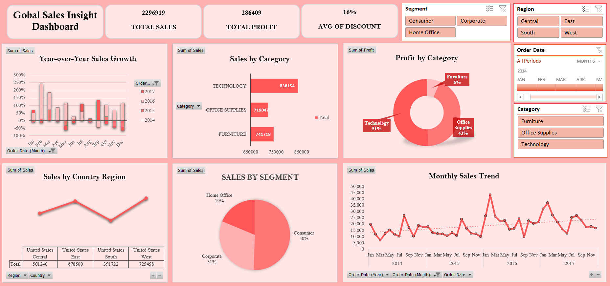

# 📊 Superstore Sales Insight Dashboard

This project presents an **interactive Excel dashboard** analyzing the *Global Superstore* dataset (2014–2017).  
It highlights **sales performance, profit trends, discounts, and growth insights** across different dimensions.

---

## 🚀 Project Overview
- Built a professional **Excel dashboard** with slicers and interactive visuals.  
- Analyzed sales across **category, segment, country region, and time**.  
- Added **Year-over-Year (YoY) growth analysis** and **monthly sales trends**.  
- Provided key insights to support **business decision-making**.  

---

## 📸 Dashboard Preview
  

---

## 🔑 Key Insights
- **Total Sales:** $2,296,919 | **Total Profit:** $286,409 | **Average Discount:** 16%  
- **Technology** contributed the highest sales and profits.  
- **Consumer segment** made up 50% of sales.  
- **West region** was the strongest performing market.  
- Sales show clear **seasonal patterns** with fluctuations month-to-month.  
- YoY Growth identifies strong growth in 2016 but some declines in late 2017.  

---

## 🛠️ Tools Used
- Microsoft Excel (PivotTables, PivotCharts, Slicers, Conditional Formatting)  

---

## 📖 How to Use
1. Download `SuperStore_Analysis.xlsx`.  
2. Open in Microsoft Excel (2016 or later recommended).  
3. Interact with slicers (Region, Segment, Category, Order Date) to explore insights.  

---

## 📜 License
This project is for learning and portfolio purposes. No commercial license included.  

---

## 👩‍💻 Created by
**C Arul Francisca**  
- Fresher
- Aspiring Data Analyst  
